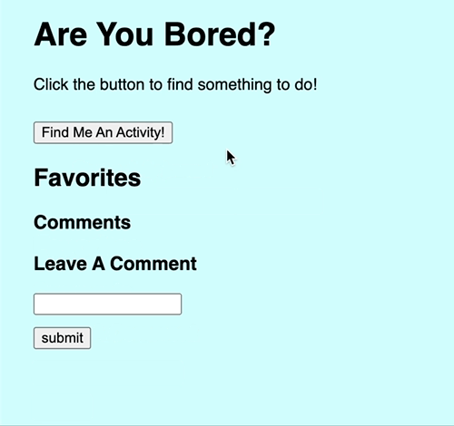

# Activity When Bored  

### Overview 
This is a website for those who are bored and just need something to do. They can find a bunch of activities that can be recreational, social, entertaining, productive, etc. 

### Get Your Own Copy 
To get your own copy: 

1. Fork this repo (https://github.com/Devin-Ho/Activites-When-Bored)
2. Click the green 'Code' button at the top right and copy the link
3. In your terminal, navigate to the directory in which to clone the repo
4. Type `git clone <copied-link>` and hit enter
5. Type `cd bored` and hit enter
6. Run `open index.html` (if on Windows, navigate to the index.html in your File Explorer and open the file in your browser)

You can watch a short walkthrough video of this project [here.](https://drive.google.com/file/d/1h-uOnP7byno81iPWzST8WMTNm2rhoeVi/view?usp=sharing)

### How To Use 

It's super simple to use! 

To get an acitivity all you have to do is click on the "Find Me An Activity" button. Continue clicking on "Find Me An Activity" button until you are satisfied with the activity 

Once you get an activity, two buttons will appear. A "Show More Information" button will tell you how many participants you need and what type of activity it is, and an "I Love This" button will let you save the activity for later. 

Once you click the "I Love This Button", the activity will simply appear under the Favorites section, where this is also a delete button that will delete the activity should you change your mind about it. 

Lastly, there is a comment section. Simply, add in comments for next time you do that activity. In this section, you will also be able to delete any comments, should you not need them anymore. 

The comments box will also appear yellow when you click in it so you're in the comments box. Just click outside of the box, to make the yellow box go away. 

